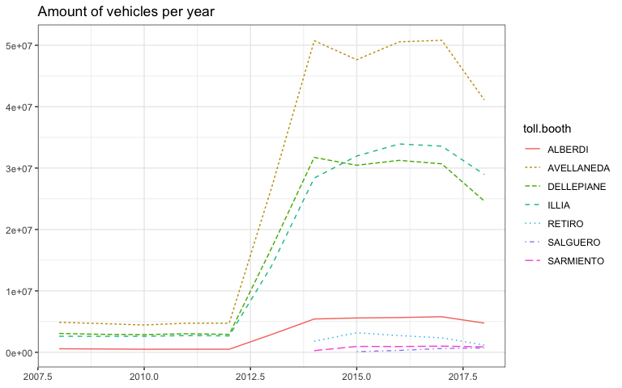
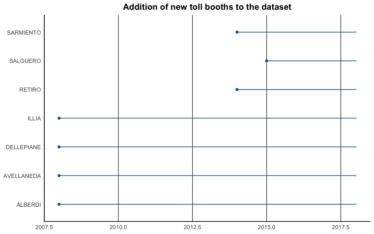
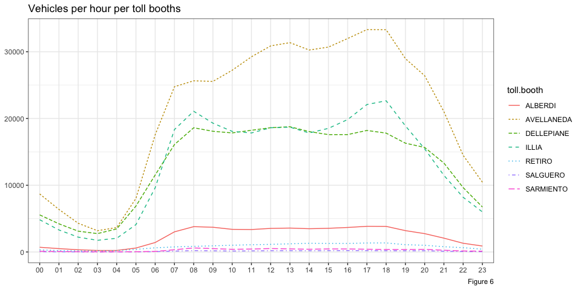
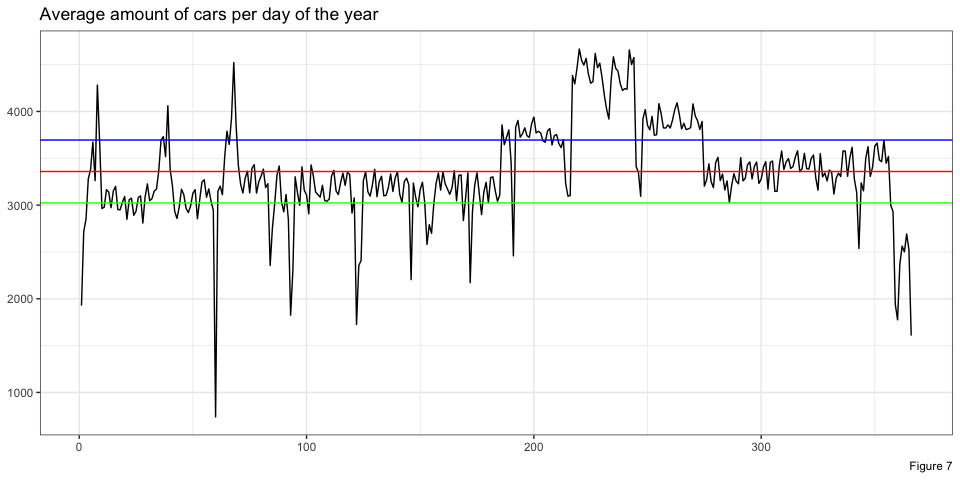
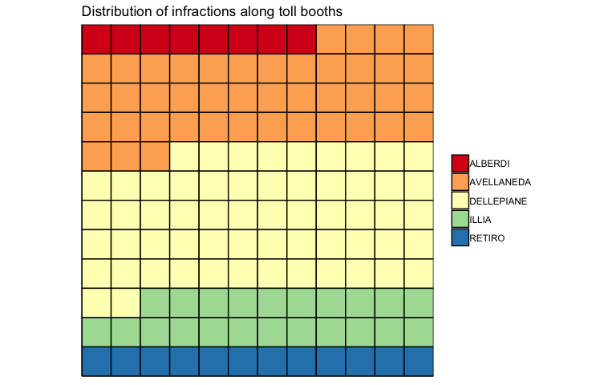
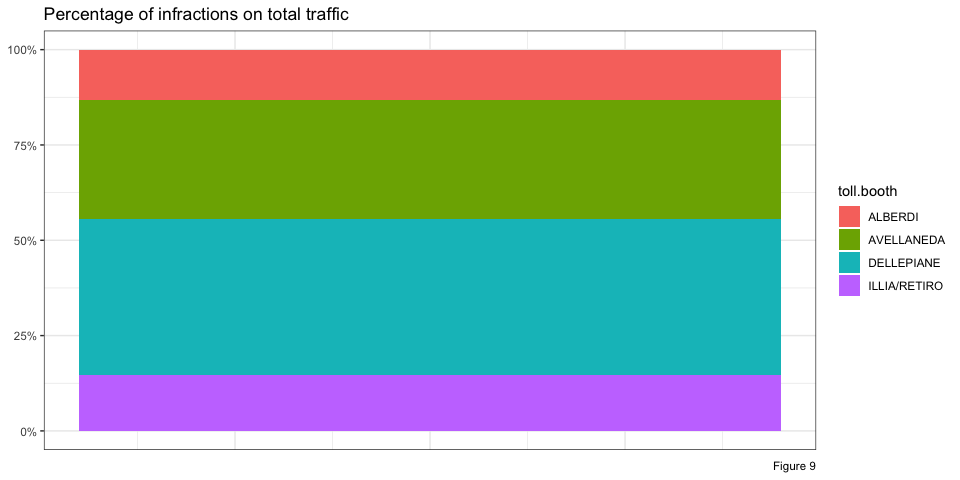
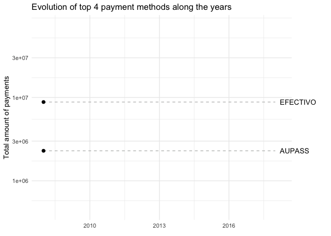
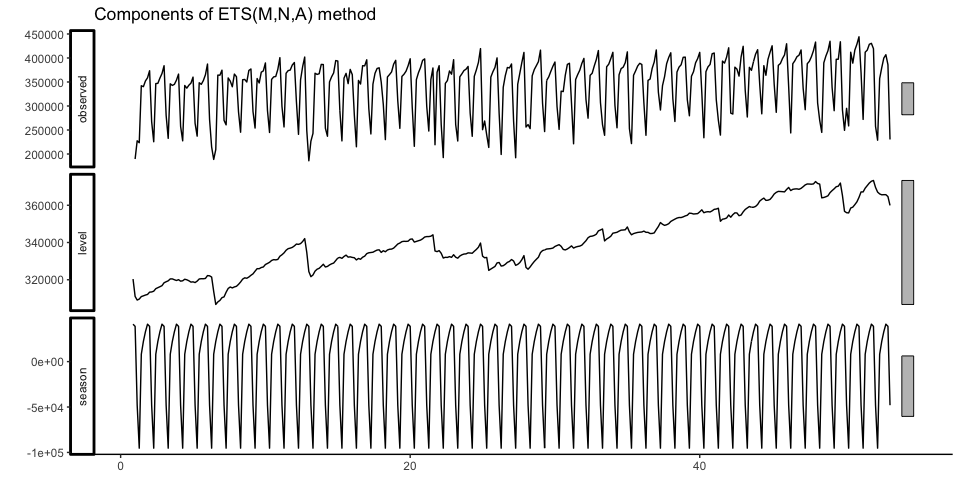

-   [Objective](#objective)
-   [Prework](#prework)
-   [Structure of the data to use](#structure-of-the-data-to-use)
-   [Exploratory analysis](#exploratory-analysis)
-   [Analyzing traffic as a time series](#analyzing-traffic-as-a-time-series)
-   [Conclusions and next steps](#conclusions-and-next-steps)

### Objective

This project consists on analyzing the evolution of traffic on AUSA toll booths in Buenos Aires highways. The data being used in this project can be found in the [Buenos Aires Data](https://data.buenosaires.gob.ar/dataset/flujo-vehicular-por-unidades-de-peaje-ausa) site. In particular, the project aims to predict the amount of vehicles going through toll booths for a given date in the future. Concretely, given a week *w*<sub>*i*</sub> the model will be able to predict the traffic volume on weeks *w*<sub>*i* + 1</sub> and *w*<sub>*i* + 2</sub>.

### Prework

-   Unzip the `Flujo-Vehicular-por-Unidades-de-Peaje-AUSA.zip` file provided by the [Buenos Aires Data](https://data.buenosaires.gob.ar/dataset/flujo-vehicular-por-unidades-de-peaje-ausa) site. This .zip file contains eleven .csv files.
-   Run the `standardize.values()` function from `utils.R`. This function will perform certain transformations in the unzipped .csv files, and will generate a file called `traffic.csv`. This function takes some minutes to finish (approximately 5 minutes).
-   For details on how graphs were generated, please take a look at `README.Rmd` and `src/utils.R`.

### Structure of the data to use

The information provided consists of eleven files, one for each year from 2008 to 2018 (where the latter only provides information until September 9th). Among these files, there is no strict convention on the columns naming, neither on whether categorical values are stored with uppercase letters or a mixture of uppercase and lowercase. To standardize everything to the same criteria, several transformations were performed. Those transformations are defined in `src/utils.R` and consist of:

-   `standardize.columns.and.merge_`: not all of the files have the same column names, nor the same column order. This function standardizes their format, and merges them all in a single .csv file.
-   `standardize.values`: among categorical attributes, not all of them have the same value for the same concept, for example you could find the same toll booth name written in all caps and then all lowers. This function standardizes that, and creates a new data set.

Great part of the work was devoted to obtaining an homogeneous data set. The following bullets show the transformation steps followed to transform the eleven heterogeneous and non-standardized files into a single homogeneous one:

-   Separators: characters used as column separators were not consistent across the different eleven files, as the vast majority used the ';' character, while the 2018 file used ','.
-   Header names: names used for file headers differed among the original eleven files, in aspects such as
    -   Not being consistent when using '\_' (underscore) to separate words when the column name consists of more than one word.
    -   Not using the same column ordering.
    -   Lastly, not being consistent on whether to use all upper- or all lower-case characters.
-   No consistency on how to write categorical values: as time went by, the name for a given toll booth changed. For example, you could find the 'Retiro' toll booth named as either 'RET', 'Retiro' or 'RETIRO', depending on which file you were looking at. The same level of inconsistency can be found for attributes like the day name and vehicle type.
-   Time convention: all time values related to hours, minutes and seconds where homogenized to the `HH:MM:SS` format. This action was performed as there were instances in which the format was `H:MM:SS`, or even `HH`.
-   Date formats: this particular section was the one that required more time. All eleven files have a column named `FECHA`, but its format was inconsistent among groups of files. To get dates right, a combination of reading with different formats and moving them to R's date standard was needed. In the end this column was divided into three new ones, one for each component of a date (year, month, day), to allow the user to perform aggregations in a more flexible way, rather than just by day. What follows is the date format that each file had.
    -   Files of 2008 all the way to 2013 used the `MM/DD/YYYY` format.
    -   Files of 2014 and 2015 used the `DD/MM/YYYY` format.
    -   Files of 2016 and 2017 used the `YYYY-MM-DD`.
    -   The file of 2018 also uses `YYYY-MM-DD`, but its rows increase by month and then by date, which ends up leaving the file with an incorrect order. An example of how dates transition on this file is:

            2018,2018-11-01,JUEVES,21:00:00,22:00:00,DELLEPIANE LINIERS,PESADO,EFECTIVO,28
            2018,2018-11-01,JUEVES,21:00:00,22:00:00,DELLEPIANE LINIERS,PESADO,INFRACCION,5
            2018,2018-11-01,JUEVES,21:00:00,22:00:00,DELLEPIANE LINIERS,PESADO,AUPASS,59
            2018,2018-11-01,JUEVES,21:00:00,22:00:00,DELLEPIANE LINIERS,PESADO,AUPASS,3
            ...
            2018,2018-12-01,VIERNES,23:00:00,00:00:00,RETIRO,PESADO,AUPASS,5
            2018,2018-12-01,VIERNES,23:00:00,00:00:00,SALGUERO,LIVIANO,NO COBRADO,10
            2018,2018-12-01,VIERNES,23:00:00,00:00:00,SALGUERO,LIVIANO,AUPASS,18
            2018,2018-12-01,VIERNES,23:00:00,00:00:00,SARMIENTO,LIVIANO,NO COBRADO,13
            2018,2018-12-01,VIERNES,23:00:00,00:00:00,SARMIENTO,LIVIANO,AUPASS,36
            2018,2018-01-13,SABADO,00:00:00,01:00:00,ALBERDI,LIVIANO,NO COBRADO,1
            2018,2018-01-13,SABADO,00:00:00,01:00:00,ALBERDI,LIVIANO,EFECTIVO,6
            2018,2018-01-13,SABADO,00:00:00,01:00:00,ALBERDI,LIVIANO,EXENTO,3
            2018,2018-01-13,SABADO,00:00:00,01:00:00,ALBERDI,LIVIANO,EFECTIVO,167
            ...
            2018,2018-01-14,DOMINGO,03:00:00,04:00:00,SALGUERO,LIVIANO,NO COBRADO,10
            2018,2018-01-14,DOMINGO,03:00:00,04:00:00,SALGUERO,LIVIANO,AUPASS,9
            2018,2018-01-14,DOMINGO,03:00:00,04:00:00,SARMIENTO,LIVIANO,NO COBRADO,14
            2018,2018-01-14,DOMINGO,03:00:00,04:00:00,SARMIENTO,LIVIANO,NO COBRADO,1

The original .csv files provide in each entry an estimate of the amount of vehicles that went through a certain toll both in an interval of time of one hour. After all the transformations mentioned above the finalized data sets consists of the following columns:

-   `Y`: indicates the **year** number.
-   `M`: indicates the **month** number.
-   `D`: indicates the **day** number.
-   `Q`: indicates the **quarter** number.
-   `day.name`: indicates the **day of the week**.
-   `start.hour`: indicates the **start time of the interval**.
-   `end.hour`: indicates the **end time of the interval**.
-   `toll.booth`: indicates the **name of the toll booth**.
-   `vehicle.type`: indicates whether the vehicle was a **truck or a car**.
-   `payment.method`: indicates if the **payment method**.
-   `amount`: indicates the **number of vehicles** that went through the toll booth at that interval of time, and payed with a given payment method.

In addition to the previously mentioned columns, two new columns were added to include the geographic position of each toll booth via coordinates, `lat` and `long`. The values of each coordinate were not provided by the data set, and had to be manually searched using Google Maps.

In the end, the first rows from the data set being used look like this:

    ##   toll.booth start.hour end.hour day.name vehicle.type       lat      long
    ## 1    ALBERDI   00:00:00 01:00:00   MARTES      LIVIANO -34.64480 -58.49205
    ## 2 AVELLANEDA   00:00:00 01:00:00   MARTES      LIVIANO -34.64827 -58.47811
    ## 3 DELLEPIANE   00:00:00 01:00:00   MARTES      LIVIANO -34.65047 -58.46561
    ## 4      ILLIA   00:00:00 01:00:00   MARTES      LIVIANO -34.57525 -58.39211
    ## 5    ALBERDI   01:00:00 02:00:00   MARTES      LIVIANO -34.64480 -58.49205
    ## 6 AVELLANEDA   01:00:00 02:00:00   MARTES      LIVIANO -34.64827 -58.47811
    ##      Y M D payment.method amount Q
    ## 1 2008 1 1       EFECTIVO      7 1
    ## 2 2008 1 1       EFECTIVO     71 1
    ## 3 2008 1 1       EFECTIVO     34 1
    ## 4 2008 1 1       EFECTIVO     27 1
    ## 5 2008 1 1       EFECTIVO     37 1
    ## 6 2008 1 1       EFECTIVO    345 1

### Exploratory analysis

The analysis to be presented in this section has the objective of getting to know better the data set, and will consist primarily on four areas:

-   The increment in the number of observations that happens during 2014.
-   The hourly patterns vehicle follow in and out of the city of Buenos Aires.
-   The distribution of drivers committing infractions.
-   The change on how drivers pay in toll booths along the years.

#### Increment in traffic

The first analysis performed right after the cleansing and wrangling of the data set was checking whether the data set was homogeneous in terms of the amount of observations per year. It would be expected to see differences among years, given that from one year to the next one the could be more vehicles on the road (more taking into account this is Buenos Aires traffic), but the actual difference in volume was far from expected.


From the graph above it's clear there's an order of magnitude of difference between the amount of vehicles in the 2008-2013 period versus the period 2014-2018. That could also be inferred from the number of rows on the files.

``` bash
cd ~/Documents/traffic/datasets/flujo-vehicular-por-unidades-de-peaje-ausa
find . -name '*.csv' -exec wc -l {} \;
```

    ##   847751 ./flujo-vehicular-2018.csv
    ##   140161 ./flujo-vehicular-2009.csv
    ##   140517 ./flujo-vehicular-2008.csv
    ##   140533 ./flujo-vehicular-2012.csv
    ##   215868 ./flujo-vehicular-2013.csv
    ##   140157 ./flujo-vehicular-2011.csv
    ##   140149 ./flujo-vehicular-2010.csv
    ##   908847 ./flujo-vehicular-2014.csv
    ##  1048576 ./flujo-vehicular-2015.csv
    ##  1030020 ./flujo-vehicular-2017.csv
    ##  1040856 ./flujo-vehicular-2016.csv

This order of magnitude of difference in the number of observations can't be explained with a real increase of such amount in the number of cars going in and out the city, as that would mean and increase of ten times the amount of vehicles in the period 2012-2014. I posted a [question](http://disq.us/p/1ynoflv) on the [web site](https://data.buenosaires.gob.ar/dataset/flujo-vehicular-por-unidades-de-peaje-ausa) that provides the information, asking for clarifications.

Looking deeper into the increment, a breakdown per toll booth name was performed, which indicated the main contributors for the increase in the number of observations per year were the *Avellaneda*, *Alberdi* and *Dellepiane* toll booths. Right after these top three contributors, there are other four toll booths, and as it can be see, three of them start having observations around mid-2014 and the start of 2015. Figures 2 and 3 below illustrate these points: the first one shows the breakdown per toll booth, while the second one shows the start dates of each one of them.





Another point worth mentioning for this section is whether there's a difference between the *Illia* toll booth and the *Retiro* one. Geographically, the *Retiro* toll booth is located in the *President Arturo Umberto Illia* highway, however there are no signs of where the *Illia* toll booth could be. In the beginning one hypothesis was that there was a change in names, so that both names refer to the same toll booth, but as shown in both Figure 2 and 3, *Illia* has been on since the first 2008 file, and it wasn't until 2014 that *Retiro* started to appear in files, with a low contribution. Given this context, and after finding no information in the news, there two toll booths will be considered separately, as the contribution of *Retiro* will not change the behavior of *Illia*.

Lastly, it's important to highlight a difference between the seven toll booths present in this data set. The group of *Alberdi*, *Avellaneda*, *Dellepiane* and *Illia/Retiro* are toll booths located in highways, while the remaining Sarmiento and Salguero are actually outside the Illia highway. They are both entrance and exit to the Illia highway, and its only payment method is via AUPASS (which is the automatic option). This is shown in Figure 4, where both *Sarmiento* and *Salguero* have no cash-related payment method.


#### Volume of traffic during the day

In this section the data set will be analyzed for hourly patterns in traffic volume, with the objective to identify if there are common patterns shared by groups or all toll booths. It would be expected to see an increase in vehicles going through toll booths at peak times like 7-8am and 5-7pm, as those are times in which the vast majority of people commute to and from work.


Figure 4 shows the amount of vehicles going through Buenos Aires toll booths, with a breakdown per hour and vehicle type. The red solid line indicates light vehicles, like cars and motorbikes, while the dashed light blue line indicates heavy vehicles, like trucks. Looking at the behavior of both curves, the do have peaks at the two intervals of time mentioned before, but also there's a third peak that was unexpected for me in the beginning. The third peak happens between 12pm and 2pm, and could be related to people who start or finish their workday around that time.



From Figure 6 there are some aspects to analyze: \* It was know from Figure 2 that the *Avellaneda* toll booth was the one with more traffic, but the breakdown Figure 5 provides show that there's an incremental flow of vehicles going through this toll booth in from 7am to 6pm. This behavior is different to that of the rest of the toll booths. The fact that there are more vehicles going through the *Avellaneda* toll booth at 6pm than 7am could imply the Perito Moreno highway (which is where the *Avellaneda* toll booth is located) is a good option for leaving the Buenos Aires city, rather that entering the city. \* The second most used toll both is the *Illia* one (plus *Retiro*), which happens to be the one with the most clear peaks in traffic among all toll booths. Those can be seen a 8am and 6pm, which could imply this highway is mostly used for people commuting to and from their work. This is supported by the "valley" between those hours, where there is a reduction in traffic. Making a parallelism with the point made above for the *Avellaneda* toll booth, the *Illia/Retiro* one has a more balanced set of peaks, which can be interpreted as if the Presidente Arturo Umberto Illia highway is used by drivers both to enter and leave the city.

The last set of patters that I wanted to analyze in this section was whether there are particular days during the year where traffic is either very high or very low compared to the average week day. Figure 7 shows the aggregate of traffic for each day of the year, taking into account all eleven files of data. Three horizontal lines feature in this graph, representing thresholds like 10% more than the mean, the mean and 10% less than the mean, in blue, red and green respectively. 

From the days above the blue line and below the green line, we can identify particular dates that explain why there was more (or less) amount of traffic than on a regular day. \* Starting with days with more than 10% of the usual traffic, we can find the winter holidays period spanning from July to August. \* On the other hand, days with less than 10% of the usual traffic are the first and last day of a given year, which can be explained by the fact that people are celebrating in their houses; the last week of the year, which includes the Christmas celebrations and the days before New Years Eve; holidays like May Revolution on May 25th, Labor Day on May 1st, Independence on July 9th, or Feast of the Immaculate Conception on December 8th.

#### Drivers commiting infractions

Among the many payment methods available in the data set, infractions is the only one which has a negative connotation, as it involves drives not paying the obligatory fee when crossing the toll booth. Figure 8 shows the distribution of infractions along the different toll booths. Those toll booths with more squares of their color are the ones where more infractions happen. *Salguero* and *Sarmiento* toll booths don't seem to be measuring this kind of phenomenon.



However, it's expected that toll booths like Avellaneda, Dellepiane and Illia/Retiro have more infractions than the rest of the toll booths, as they have more traffic as per Figure 2. For this reason, Figure 9 shows the which is the relative percentage of infractions, as it takes into account the total traffic of each toll booth. Having such information shows that the toll booth where there are more infractions is the *Dellepiane* one, with approximately 0.6% of its traffic being only infractions.




#### Evolution of payment methods

Another interesting phenomenon are users moving from paying in cash (EFECTIVO) to using automatic tolls (AUPASS). Looking at the animation below, 2016 starts showing a decline in the number of vehicle owners paying in *cash*. However, since 2014 the use of *automatic tolls* started to steadily increase. As a note, the decline in 2018 on both cash and automatic tolls is due to the fact that 2018 data is still not complete.



### Analyzing traffic as a time series


#### Predicting next two weeks' traffic volume toll booths



### Conclusions and next steps
