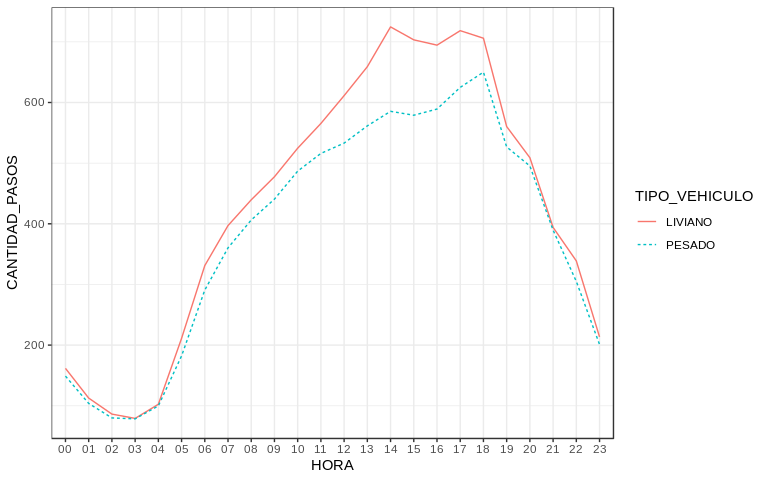

-   [Objective](#objective)
-   [Structure of the data to use](#structure-of-the-data-to-use)
-   [Exploratory analysis](#exploratory-analysis)
-   [Predicting tomorrow's traffic volume on each toll booth](#predicting-tomorrows-traffic-volume-on-each-toll-booth)

### Objective

This project consists on analyzing the evolution of traffic on AUSA toll booths in Buenos Aires highways. The data being used in this project can be found on the [Buenos Aires Data](https://data.buenosaires.gob.ar/dataset/flujo-vehicular-por-unidades-de-peaje-ausa) site. In particular, it aims to predict the amount of vehicles going in and out of the city for a given date in the future. So, if given a day *d*<sub>*i*</sub>, the model will be able to predict the traffic volume on day *d*<sub>*i* + 1</sub>.

### Structure of the data to use

The information provided consists of 11 files, one for each year from 2008 to 2018. There is no strict convention on the columns naming, neither on whether categorical values are stored with uppercase letters or a mixture of uppercase and lowercase. To standardize everything to the same criteria, several transformations were performed.

The .csv files provide in each entry an estimate of the amount of vehicles that went through a certain toll both in an interval of time of one hour. The following is the detail of each column:

-   PERIODO: indicates the **year**.
-   FECHA: indicates the **full date** in *dd/mm/yyyy* format.
-   DIA: indicates the **day of the week**.
-   HORA: indicates the **start time of the interval**.
-   HORA\_FIN: indicates the **end time of the interval**.
-   ESTACION: indicates the **name of the toll booth**.
-   TIPO\_VEHICULO: indicates whether the vehicle was a **truck or a car**.
-   FORMA\_PAGO: indicates if the **payment method**.
-   CANTIDAD\_PASOS: indicates the **number of vehicles** that went through the toll booth at that interval of time, and payed with a given payment method.

For example:

``` r
# Include the definitions of the methods used throughout the notebook.
source('./src/flow.R')
df <- read.csv('~/Documents/traffic/datasets/traffic.csv')
head(df)
```

    ##   PERIODO      FECHA    DIA     HORA HORA_FIN   ESTACION TIPO_VEHICULO
    ## 1    2008 01/01/2008 MARTES 00:00:00 01:00:00    ALBERDI       LIVIANO
    ## 2    2008 01/01/2008 MARTES 00:00:00 01:00:00 AVELLANEDA       LIVIANO
    ## 3    2008 01/01/2008 MARTES 00:00:00 01:00:00        DEL       LIVIANO
    ## 4    2008 01/01/2008 MARTES 00:00:00 01:00:00      ILLIA       LIVIANO
    ## 5    2008 01/01/2008 MARTES 01:00:00 02:00:00    ALBERDI       LIVIANO
    ## 6    2008 01/01/2008 MARTES 01:00:00 02:00:00 AVELLANEDA       LIVIANO
    ##   FORMA_PAGO CANTIDAD_PASOS
    ## 1   EFECTIVO              7
    ## 2   EFECTIVO             71
    ## 3   EFECTIVO             34
    ## 4   EFECTIVO             27
    ## 5   EFECTIVO             37
    ## 6   EFECTIVO            345

### Exploratory analysis

As a way of starting to know this dataset, we can see that there is a difference on the amount of entries in each file of our dataset.

``` r
volume.per.year <- df %>%
    group_by(PERIODO) %>% 
    summarise(CANTIDAD_PASOS = sum(CANTIDAD_PASOS))
trend <- lm(volume.per.year$CANTIDAD_PASOS ~ volume.per.year$PERIODO)
plot(volume.per.year$CANTIDAD_PASOS ~ volume.per.year$PERIODO, 
     xlab = 'Time (years)', ylab = 'Number of vehicles')
abline(trend, col = 'red')
```


For the graph above it's clear there's an order of magnitud of difference between the amount of vehicles in the period 2008-2013 versus the period 2014-2018. This doesn't mean the number of vehicles skyrocketed in a matter of two years, but rather that new toll booth locations were added to the dataset along those years, which ended up adding 10x more information. To make this evident, compare the amount of toll booths on this heatmap from 2013

``` r
plot(traffic.volume.heatmap(2013))
```


with those on this other one from 2015:

``` r
plot(traffic.volume.heatmap(2015))
```


Each cell in the previous two heatmaps holds the normalized values (to the range \[0, 1\]) of the traffic volume for each toll booth for each day, being DOMINGO (Sunday) the day where the lowest amount of vehicles is registered, and VIERNES (Friday) the one in which there's higher volume of traffic, in most cases.

This traffic flow holds a pattern for each toll booth. Performing an hourly breakdown of traffic for the Alberdi tool booth, shown in the following graph, two traffic peaks can be identified: one around 8am and another one around 6pm. This matches with the times people is commuting to an from work. Another interesting pattern is that traffic keeps relatively still between the time of the two peaks.

``` r
plot(hourly.breakdown(df, (df$ESTACION == 'ALBERDI')))
```


The previous graph differenciates between the two different kinds of vehicles: motorbikes/cars and trucks. While both kinds show a similar behavior, the volume of motorbikes/cars is greater than the one of trucks. Although this behavior can be seen in other toll booths like Avellaneda or Sarmiento, there are cases like Retiro, where the amount of trucks is almost the same as the one of cars.

``` r
plot(hourly.breakdown(df, (df$ESTACION == 'RETIRO')))
```



### Predicting tomorrow's traffic volume on each toll booth
