-   [Objective](#objective)
-   [Prework](#prework)
-   [Structure of the data to use](#structure-of-the-data-to-use)
-   [Exploratory analysis](#exploratory-analysis)
-   [Analyzing traffic as a time-series and forecasting future traffic](#analyzing-traffic-as-a-time-series-and-forecasting-future-traffic)
-   [Conclusions and next steps](#conclusions-and-next-steps)

### Objective

This project consists on analyzing the evolution of traffic on AUSA toll booths in Buenos Aires highways. The data being used in this project can be found in the [Buenos Aires Data](https://data.buenosaires.gob.ar/dataset/flujo-vehicular-por-unidades-de-peaje-ausa) site. In particular, the project aims to predict the amount of vehicles going through toll booths for a given date in the future. Concretely, given a week *w**i* the model will be able to predict the traffic volume on weeks *w**i* + 1 and *w**i* + 2.

### Prework

-   Unzip the `Flujo-Vehicular-por-Unidades-de-Peaje-AUSA.zip` file provided by the [Buenos Aires Data](https://data.buenosaires.gob.ar/dataset/flujo-vehicular-por-unidades-de-peaje-ausa) site. This .zip file contains eleven .csv files.
-   Run the `standardize.traffic()` function from `wrangling.R`. This function will perform certain transformations in the unzipped .csv files, and will generate a file called `traffic.csv`. This function takes some minutes to finish (approximately 5 minutes).
-   For details on how graphs were generated, please take a look at `README.Rmd` and `src/wrangling.R`.

### Structure of the data to use

The information provided consists of eleven files, one for each year from 2008 to 2018 (where the latter only provides information until September 30th). Among these files, there is no strict convention on the columns naming, neither on whether categorical values are stored with uppercase letters or a mixture of uppercase and lowercase. To standardize everything to the same criteria, several transformations were performed. Those transformations are defined in `src/wrangling.R` and consist of:

-   `join.traffic.files`: not all of the files have the same column names, nor the same column order. This function standardizes their format, and merges them all in a single .csv file.
-   `standardize.traffic`: among categorical attributes, not all of them have the same value for the same concept, for example you could find the same toll booth name written in all caps and then all lowers. This function standardizes that, and creates a new data set.

Great part of the work was devoted to obtaining an homogeneous data set. The following bullets show the transformation steps followed to transform the eleven heterogeneous and non-standardized files into a single homogeneous one:

-   Separators: characters used as column separators were not consistent across the different eleven files, as the vast majority used the ';' character, while the 2018 file used ','.
-   Header names: names used for file headers differed among the original eleven files, in aspects such as
    -   Not being consistent when using '\_' (underscore) to separate words when the column name consists of more than one word.
    -   Not using the same column ordering.
    -   Lastly, not being consistent on whether to use all upper- or all lower-case characters.
-   No consistency on how to write categorical values: as time went by, the name for a given toll booth changed. For example, you could find the 'Retiro' toll booth named as either 'RET', 'Retiro' or 'RETIRO', depending on which file you were looking at. The same level of inconsistency can be found for attributes like the day name and vehicle type.
-   Time convention: all time values related to hours, minutes and seconds where homogenized to the `HH:MM:SS` format. This action was performed as there were instances in which the format was `H:MM:SS`, or even `HH`.
-   Date formats: this particular section was the one that required most time. All eleven files have a column named `FECHA`, but its format was inconsistent among groups of files. To get dates right, a combination of reading with different formats and moving them to R's date standard was needed. In the end this column was divided into three new ones, one for each component of a date (year, month, day), to allow the user to perform aggregations in a more flexible way, rather than just by day. What follows is the date format that each file had.
    -   Files of 2008 all the way to 2013 used the `MM/DD/YYYY` format.
    -   Files of 2014 and 2015 used the `DD/MM/YYYY` format.
    -   Files of 2016 and 2017 used the `YYYY-MM-DD`.
    -   The file of 2018 also uses `YYYY-MM-DD`, but its rows increase by month and then by date, which ends up leaving the file with an incorrect order. An example of how dates transition on this file is:

            2018,2018-11-01,JUEVES,21:00:00,22:00:00,DELLEPIANE LINIERS,PESADO,EFECTIVO,28
            2018,2018-11-01,JUEVES,21:00:00,22:00:00,DELLEPIANE LINIERS,PESADO,INFRACCION,5
            2018,2018-11-01,JUEVES,21:00:00,22:00:00,DELLEPIANE LINIERS,PESADO,AUPASS,59
            2018,2018-11-01,JUEVES,21:00:00,22:00:00,DELLEPIANE LINIERS,PESADO,AUPASS,3
            ...
            2018,2018-12-01,VIERNES,23:00:00,00:00:00,RETIRO,PESADO,AUPASS,5
            2018,2018-12-01,VIERNES,23:00:00,00:00:00,SALGUERO,LIVIANO,NO COBRADO,10
            2018,2018-12-01,VIERNES,23:00:00,00:00:00,SALGUERO,LIVIANO,AUPASS,18
            2018,2018-12-01,VIERNES,23:00:00,00:00:00,SARMIENTO,LIVIANO,NO COBRADO,13
            2018,2018-12-01,VIERNES,23:00:00,00:00:00,SARMIENTO,LIVIANO,AUPASS,36
            2018,2018-01-13,SABADO,00:00:00,01:00:00,ALBERDI,LIVIANO,NO COBRADO,1
            2018,2018-01-13,SABADO,00:00:00,01:00:00,ALBERDI,LIVIANO,EFECTIVO,6
            2018,2018-01-13,SABADO,00:00:00,01:00:00,ALBERDI,LIVIANO,EXENTO,3
            2018,2018-01-13,SABADO,00:00:00,01:00:00,ALBERDI,LIVIANO,EFECTIVO,167
            ...
            2018,2018-01-14,DOMINGO,03:00:00,04:00:00,SALGUERO,LIVIANO,NO COBRADO,10
            2018,2018-01-14,DOMINGO,03:00:00,04:00:00,SALGUERO,LIVIANO,AUPASS,9
            2018,2018-01-14,DOMINGO,03:00:00,04:00:00,SARMIENTO,LIVIANO,NO COBRADO,14
            2018,2018-01-14,DOMINGO,03:00:00,04:00:00,SARMIENTO,LIVIANO,NO COBRADO,1

The original .csv files provide in each entry an estimate of the amount of vehicles that went through a certain toll both in an interval of time of one hour. After all the transformations mentioned above the finalized data sets consists of the following columns:

-   `Y`: indicates the **year** number.
-   `M`: indicates the **month** number.
-   `D`: indicates the **day** number.
-   `Q`: indicates the **quarter** number.
-   `day.name`: indicates the **day of the week**.
-   `start.hour`: indicates the **start time of the interval**.
-   `end.hour`: indicates the **end time of the interval**.
-   `toll.booth`: indicates the **name of the toll booth**.
-   `vehicle.type`: indicates whether the vehicle was a **truck or a car**.
-   `payment.method`: indicates which **payment method** the driver used to pay.
-   `amount`: indicates the **number of vehicles** that went through the toll booth at that interval of time, and payed with a given payment method.

In addition to the previously mentioned columns, two new columns were added to include the geographic position of each toll booth via coordinates, `lat` and `long`. The values of each coordinate were not provided by the data set, and had to be manually searched using Google Maps.

In the end, the first rows from the data set being used look like this:

    ##   toll.booth day.name vehicle.type       lat      long    Y M D
    ## 1    ALBERDI   MARTES      LIVIANO -34.64480 -58.49205 2008 1 1
    ## 2 AVELLANEDA   MARTES      LIVIANO -34.64827 -58.47811 2008 1 1
    ## 3 DELLEPIANE   MARTES      LIVIANO -34.65047 -58.46561 2008 1 1
    ## 4      ILLIA   MARTES      LIVIANO -34.57525 -58.39211 2008 1 1
    ## 5    ALBERDI   MARTES      LIVIANO -34.64480 -58.49205 2008 1 1
    ## 6 AVELLANEDA   MARTES      LIVIANO -34.64827 -58.47811 2008 1 1
    ##   payment.method amount start.hour end.hour Q
    ## 1       EFECTIVO      7   00:00:00 01:00:00 1
    ## 2       EFECTIVO     71   00:00:00 01:00:00 1
    ## 3       EFECTIVO     34   00:00:00 01:00:00 1
    ## 4       EFECTIVO     27   00:00:00 01:00:00 1
    ## 5       EFECTIVO     37   01:00:00 02:00:00 1
    ## 6       EFECTIVO    345   01:00:00 02:00:00 1

### Exploratory analysis

The analysis to be presented in this section has the objective of getting to know better the data set, and will consist primarily on four areas:

-   The increment in the number of observations that happens during 2014.
-   The hourly patterns vehicle follow in and out of the city of Buenos Aires.
-   The distribution of drivers committing infractions.
-   The change on how drivers pay in toll booths along the years.

#### Increment in traffic

The first analysis performed right after the cleansing and wrangling of the data set was checking whether the data set was homogeneous in terms of the amount of observations per year. It would be expected to see differences among years, given that from one year to the next one there could be more vehicles on the road (more taking into account this is Buenos Aires traffic), but the actual difference in volume was far from expected.

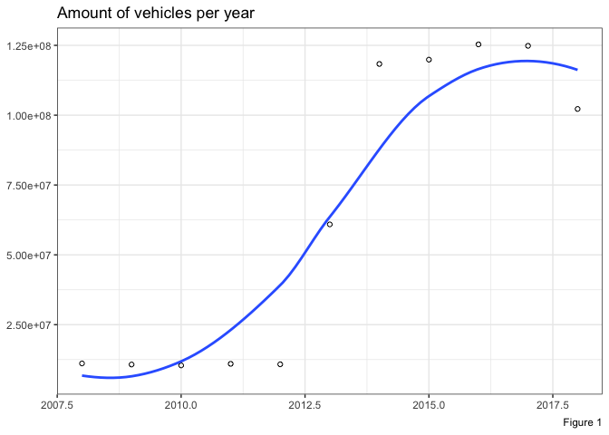

From the graph above it's clear there's an order of magnitude of difference between the amount of vehicles in the 2008-2013 period versus the period 2014-2018. That could also be inferred from the number of rows on the files.

This order of magnitude of difference in the number of observations can't be explained with a real increase of such amount in the number of cars going in and out the city, as that would mean and increase of ten times the amount of vehicles in the period 2012-2014. I posted a [question](http://disq.us/p/1ynoflv) on the [web site](https://data.buenosaires.gob.ar/dataset/flujo-vehicular-por-unidades-de-peaje-ausa) that provides the information, asking for clarifications.

Looking deeper into the increment, a breakdown per toll booth name was performed, which indicated the main contributors for the increase in the number of observations per year were the *Avellaneda*, *Alberdi* and *Dellepiane* toll booths. Right after these top three contributors, there are other four toll booths, and as it can be see, three of them start having observations around mid-2014 and the start of 2015. Figures 2 and 3 below illustrate these points: the first one shows the breakdown per toll booth, while the second one shows the start dates of each one of them.

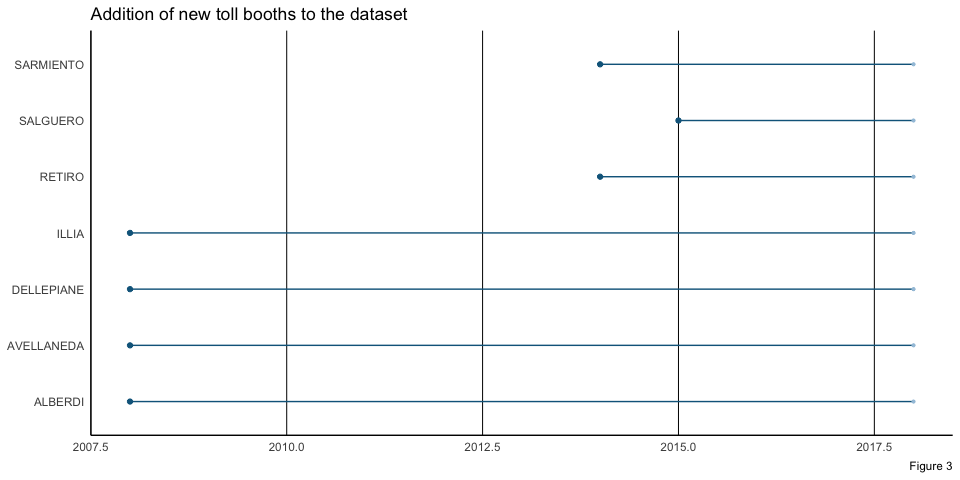

Another point worth mentioning for this section is whether there's a difference between the *Illia* toll booth and the *Retiro* one. Geographically, the *Retiro* toll booth is located in the *President Arturo Umberto Illia* highway, however there are no signs of where the *Illia* toll booth could be. In the beginning one hypothesis was that there was a change in names, so that both names refer to the same toll booth, but as shown in both Figure 2 and 3, *Illia* has been on since the first 2008 file, and it wasn't until 2014 that *Retiro* started to appear in files, with a low contribution. Given this context, and after finding no information in the news, the two toll booths will be considered separately, as the contribution of *Retiro* will not change the behavior of *Illia*.

Lastly, it's important to highlight a difference between the seven toll booths present in this data set. The group of *Alberdi*, *Avellaneda*, *Dellepiane* and *Illia/Retiro* are toll booths located in highways, while the remaining Sarmiento and Salguero are actually outside the Illia highway. They are both entrance and exit to the Illia highway, and its only payment method is via AUPASS (which is the automatic option). This is shown in Figure 4, where both *Sarmiento* and *Salguero* have no cash-related payment method.

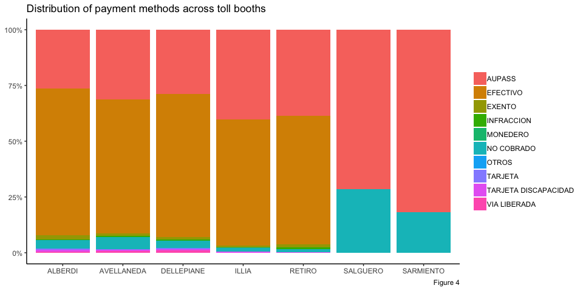

#### Volume of traffic during the day

In this section the data set will be analyzed for hourly patterns in traffic volume, with the objective to identify if there are common patterns shared by groups or all toll booths. It would be expected to see an increase in vehicles going through toll booths at peak times like 7-8am and 5-7pm, as those are times in which the vast majority of people commute to and from work.

Figure 4 shows the amount of vehicles going through Buenos Aires toll booths, with a breakdown per hour and vehicle type. The red solid line indicates light vehicles, like cars and motorbikes, while the dashed light blue line indicates heavy vehicles, like trucks. Looking at the behavior of both curves, they do have peaks at the two intervals of time mentioned before, but also there's a third peak that could be considered unexpected at first. This third peak happens between 12pm and 2pm, and could be related to people who start or finish their workday around that time.

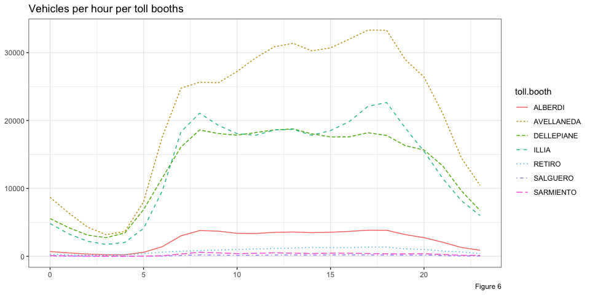

From Figure 6 there are some aspects to analyze:

-   It was know from Figure 2 that the *Avellaneda* toll booth was the one with more traffic, but the breakdown Figure 5 provides shows there's an incremental flow of vehicles going through this toll booth from 7am to 6pm. This behavior is different to that of the rest of the toll booths. The fact that there are more vehicles going through the *Avellaneda* toll booth at 6pm than 7am could imply the Perito Moreno highway (which is where the *Avellaneda* toll booth is located) is a good option for leaving Buenos Aires city, rather that entering the city.
-   The second most used toll both is the *Illia* one (plus *Retiro*), which happens to be the one with the most clear peaks in traffic among all toll booths. Those can be seen at 8am and 6pm, which could imply this highway is mostly used for people commuting to and from their work. This is supported by the "valley" between those hours, where there is a reduction in traffic. Making a parallelism with the point made above for the *Avellaneda* toll booth, the *Illia/Retiro* one has a more balanced set of peaks, which can be interpreted as if the Presidente Arturo Umberto Illia highway is used by drivers both to enter and leave the city.

The last pattern to analyze in this section is whether there are particular days during the year where traffic is either very high or very low compared to the average day. Figure 7 shows the aggregate of traffic for each day of the year, taking into account all eleven files of data. Three horizontal lines feature in this graph, representing thresholds like 10% more than the mean, the mean and 10% less than the mean, in blue, red and green respectively. 

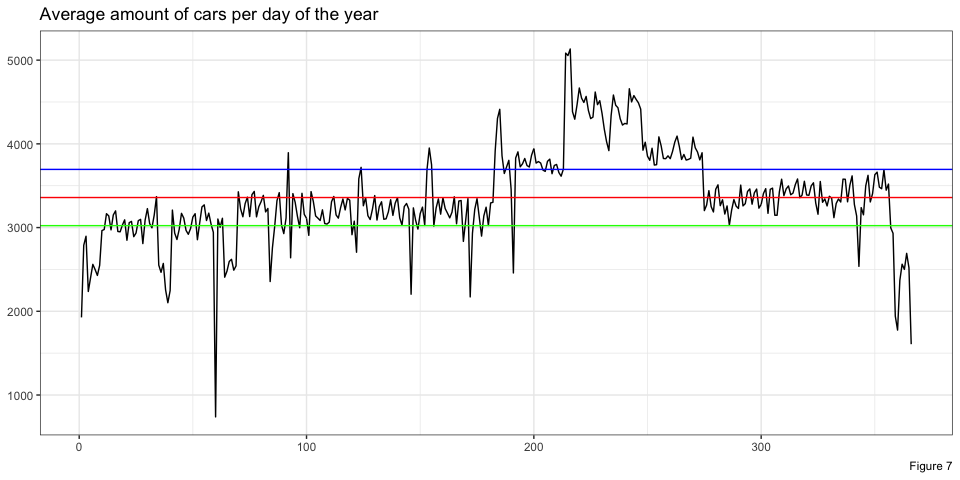

From the days above the blue line and below the green line, it is possible to identify particular dates that explain why there was more (or less) amount of traffic than on a regular day.

-   Starting with days with more than 10% of the usual traffic, the winter holidays period stands out, spanning from July to August.
-   On the other hand, days with less than 10% of the usual traffic are the first and last day of a given year, which can be explained by the fact that people are celebrating in their houses; the last week of the year, which includes Christmas celebrations and the days before New Years Eve; holidays like May Revolution on May 25th, Labor Day on May 1st, Independence on July 9th, or Feast of the Immaculate Conception on December 8th.

#### Drivers commiting infractions

Among the many payment methods available in the data set, infractions is the only one which has a negative connotation, as it involves drivers not paying the obligatory fee when crossing the toll booth. Figure 8 shows the distribution of infractions along the different toll booths. Those toll booths with more squares of their color are the ones where more infractions happen. *Salguero* and *Sarmiento* toll booths don't seem to be measuring this kind of phenomenon.

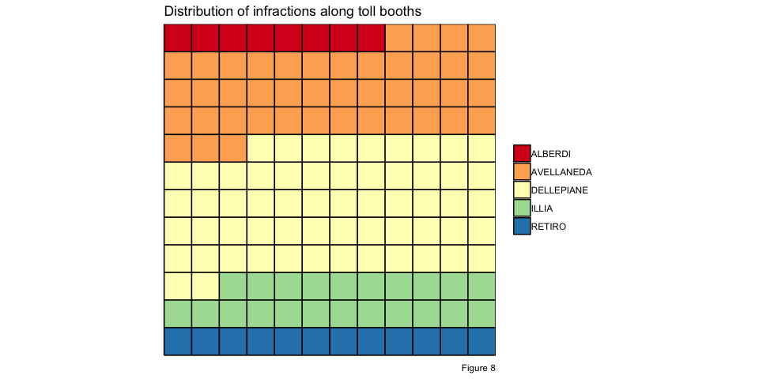

However, it's expected that toll booths like Avellaneda, Dellepiane and Illia/Retiro have more infractions than the rest of the toll booths, as they have more traffic as per Figure 2. For this reason, Figure 9 shows the relative percentage of infractions, as it takes into account the total traffic of each toll booth. Having such information shows that the toll booth where there are more infractions per vehicle is the *Dellepiane* one, with approximately 0.6% of its traffic being only infractions.

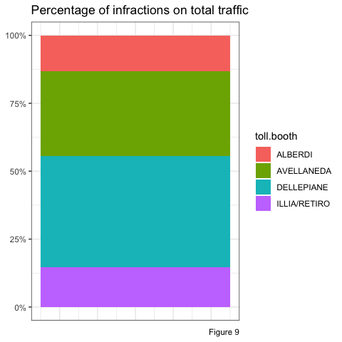

Zooming into the *Dellepiane* toll booth, it could be of interest to know when during the day do the vast majority of infractions happen. Looking at Figure 10, it can be see that 68% of the infractions happen during the interval of time between 7am and 6pm. During that time-frame a dedicated system or group of people could be put in place to control drivers and avoid them from committing infractions.

Lastly, it would also be good to know if infractions are most likely to happen in particular days of the week more than others. To check if there was a pattern of that kind, a breakdown per day of the week was performed in Figure 11, which ends up showing Tuesdays, Wednesdays, Thursdays and Fridays behave more or less the same in terms of number of infractions, with Monday being lower than them. Given that context, all days share a similar distribution of infractions (without taking into account Saturdays and Sundays which have a much lower amount due to less traffic).

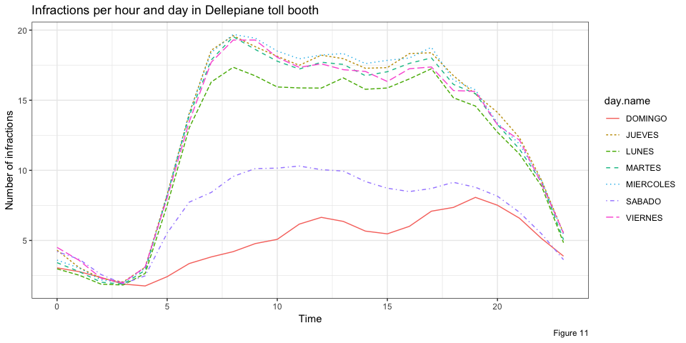

#### Evolution of payment methods

Another interesting phenomenon are users switching from paying in cash (EFECTIVO) to using automatic tolls (AUPASS). Looking at the animation below, 2016 starts showing a decline in the number of vehicle owners paying in *cash*. However, since 2014 the use of *automatic tolls* started to steadily increase.

As it can be seen by the end of the animation, the decline in 2018 on both cash and automatic tolls is due to the fact that 2018 data is still not complete. Secondly, payment methods like 'INFRACCION' and 'NO COBRADO' only appeared in 2014, which is the reason why they only show up by the middle of the animation.

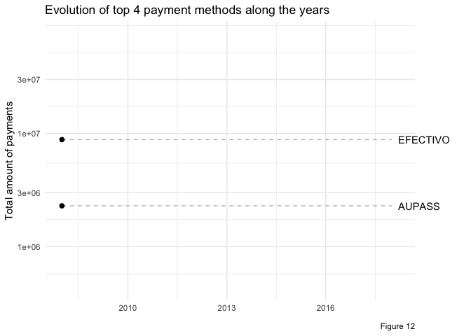

### Analyzing traffic as a time-series and forecasting future traffic

In this last section of the analysis, two predictions of future traffic based on the information our data set provides will be performed. The prediction will be performed using the `forecast` R package, which even though it not part of R's `base` core package, it's one of the renowned forecasting packages, if not the most, by the R community. In this opportunity, the objective will be, given a point in time from 2018, to predict the traffic volume from the subsequent two weeks. For this reason, the data from 2018 will be the one used in this section.

Prior to performing forecasts, the data must be transformed into a time-series object. Given all the analysis performed in previous sections, this time-series is expected to have a strong seasonal component. This seasonal component *s*(*t*) will then be influenced in a multiplicative fashion by the inherent trend *l*(*t*) in the traffic volume, thus yielding the observed curve *o*(*t*)=*s*(*t*)⋅*l*(*t*) of traffic. A multiplicative approach is used as it's visually more intuitive at the time of building the observed curve.

One important step before creating the time-series is to define which is the seasonality period to be captured from the signal. Even though the information provided by the file has hour granularity, for this particular analysis information was aggregated by day, in order to have the amount of vehicles that went through toll booths each day of 2018, since January 1st and up to September 30th. Because the granularity is at the level of days, weekly seasonality would be one that makes sense to analyze, to capture patterns that happen on a weekly basis, id est, in a period of 7 days. This is the period that will be used as input when creating the time-series.

The figure presented below shows three different functions:

-   The `observed` function which corresponds to the daily traffic volume aggregation for each day of 2018.
-   The `level` function, which describes the trend of this traffic volume along the year.
-   And lastly the `season` function, which presents the periodic patterns present in the data.

Based on the point made above, the observed function is the direct result of multiplying the `level` and `season` functions together. That's also visible in the name on the figure, *Components of ETS(M,N,M) method*, where the `M`s in the name make reference to the fact that a multiplicative approach was requested for dividing the observed time-series into the trend and seasonal components. If instead an additive approach was requested, then the observed function will have to be the result of summing together the trend function and the season function.

Another important point to define is what does ETS mean. ETS stands for Exponential Smoothing, which is a technique for smoothing time-series data using the *exponential window function*. Exponential functions are used to assign exponentially decreasing weights over time, in contrast to simple moving average windows where past observations are weighted equally. The `forecast` package uses this technique for analyzing time-series data and generates the three part decomposition.

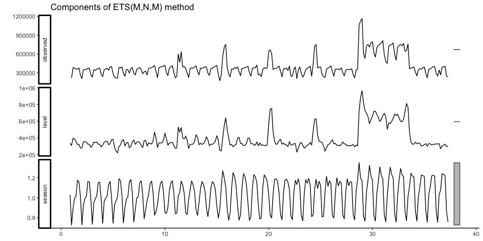

#### Predicting next two weeks' traffic volume toll booths

As the period used for the creation of the time-series was defined as weekly, the `forecast` method included in the package will return the forecasted values of the next two weeks traffic, as in this case the unit of time is a week. As 2018 data is not complete, both the previous and following graphs show less than 52 weeks (which would be an approximate of the 365.25/7 weeks an year has). The two predicted weeks will then be the first two weeks of October. These are shown near week 40 on the following graph.

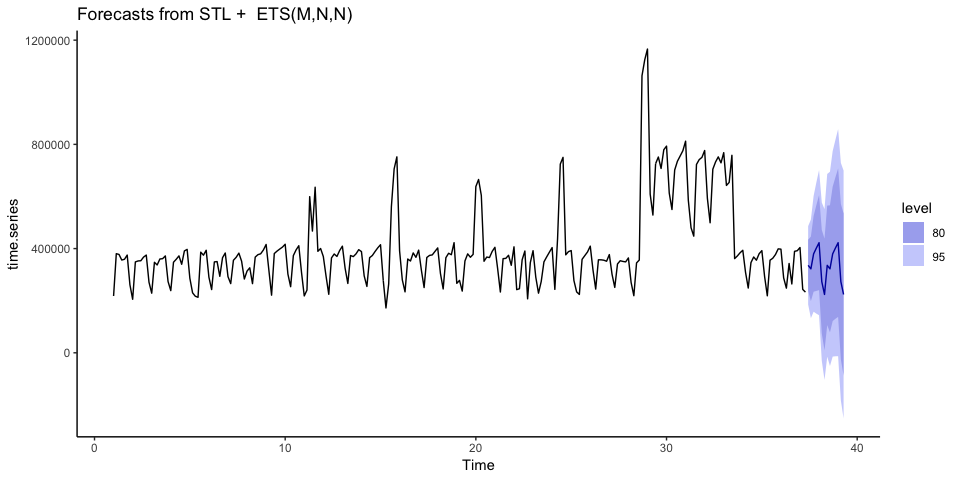

The predicted values can be identified with a solid blue line surrounded by two prediction intervals, one of 80% and another of 95%. For a prediction interval, the interval represents the range of plausible values expected to be observed at some future point in time. An 80% prediction interval can be interpreted as there is an 80% probability that the future observation's value will fall somewhere between the upper and lower bounds of such interval.

Figure 16 shows the behavior of traffic during the first two weeks of October, where the solid red line is the one for 2017, and the blue one consists of the forecasted values for 2018. Comparing the shape of each curve, it can be seen that the forecasted traffic looks similar to that of 2017, for the same period of time, with the exception of some days like those listed in the table below, where the similarity between the figures was less than 80%.

    ## Source: local data frame [5 x 4]
    ## Groups: <by row>
    ## 
    ## # A tibble: 5 x 4
    ##    date data.2017 data.2018 distance
    ##   <int>     <int>     <dbl>    <dbl>
    ## 1     1    246784   335726.     73.5
    ## 2     6    426086   273031.     64.1
    ## 3     7    340891   223894.     65.7
    ## 4    13    429028   273031.     63.6
    ## 5    14    334221   223894.     67.0

Alternatively, the same time-series can be used to perform a second prediction using another technique called [ARIMA](https://en.wikipedia.org/wiki/Autoregressive_integrated_moving_average). ARIMA stands for Autoregresive integrated moving average, and can be applied when the time-series is stationary. A series is said to be stationary when its mean, variance, and autocovariance are time invariant. This limitation is something that has to be taken into account before performing the forecast with ARIMA, as certain transformations on the time-series have to be performed. These transformations can involve differentiating the time-series in order to make it stationary, so that it's properties don't depend on the time at which the series is observed. In order to difference the data, the difference between consecutive observations is computed, which can be written as *y*′*t* = *y**t* − *y**t* − 1.

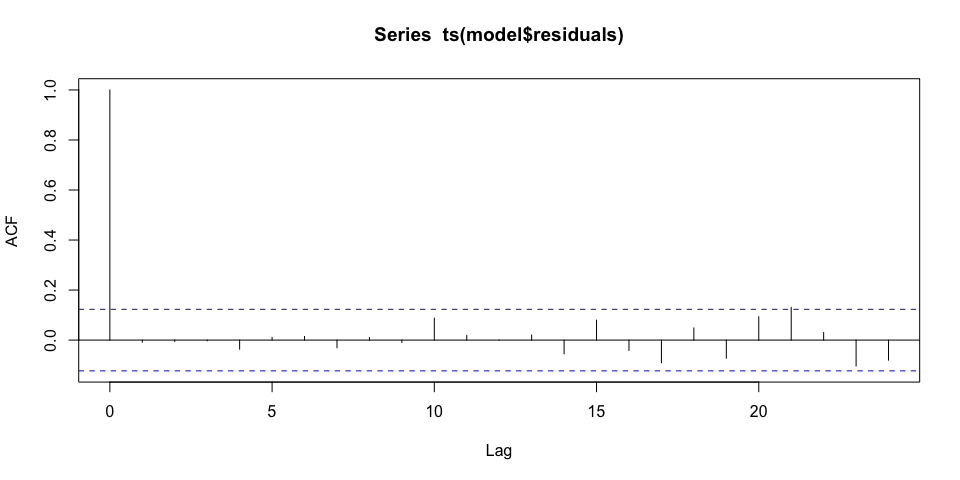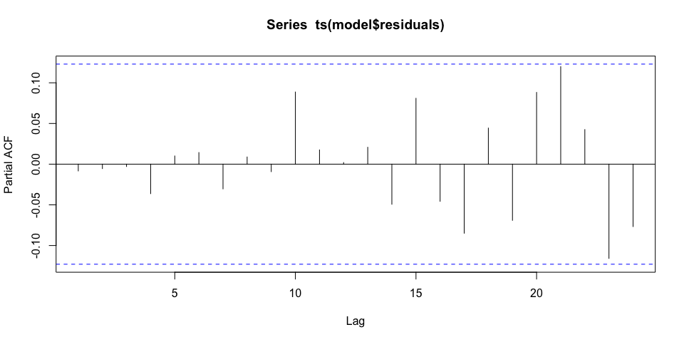

In the above two graphs, it can be seen that there are no spikes outside the 95% significance boundaries represented with the blue dotted lines. This helps conclude that the residuals of the ARIMA approach are random, and the model is working fine.

To compare the two forecast approaches, ETS and ARIMA, a common metric is needed. A metric which helps comparing models is the [AIC](https://en.wikipedia.org/wiki/Akaike_information_criterion), or Akaike information criterion, which is an estimator of the relative quality of statistical models, thus provide a means for model selection. For the particular case of the two forecast models, the *A**I**C**E**T**S* = 7218.331, while the *A**I**C**A**R**I**M**A* = 6394.42. AICs values are not compared via their absolute values, but considers their difference *Δ**i* = *A**I**C**i* − *A**I**C**m**i**n*, where *A**I**C**i* is the AIC of the *i*-th model, and *A**I**C**m**i**n* is the lowest AIC of the list of models. As in this case there are only 2 models, the ARIMA and the ETS, then *Δ* = *A**I**C**E**T**S* − *A**I**C**A**R**I**M**A* = 7218.331 − 6394.42 = 823.911. Following the rule of thumb outlined in [Burnham & Anderson 2004](http://faculty.washington.edu/skalski/classes/QERM597/papers_xtra/Burnham%20and%20Anderson.pdf)(page 12), *Δ* = 823.9 ≫ 10 then there is evidence that the ARIMA model should be preferred over the ETS one.

### Conclusions and next steps

This project was a great learning opportunity, where I was presented with a real data set, free of any kind of pre-processing, following no standards or conventions. During the process of analysis and development I learned:

-   *Structure and order matter*. This was particularly true for the data wrangling process to standardize criteria on categorical values, and more importantly **dates**. In a context in which your observations are each associated with a time metric, there's a need for those time metrics to follow the same structure, so that they can be compared one against the other. This structure will additionally allow us to order information following a certain criteria, in order to find patterns of behavior through time.
-   *Exploratory analysis is a must*. Getting to know the data you'll be working with show take an important percentage of the time, as there may be unexpected patterns. An example of this could be the peak between 12pm and 2pm in Figure 5, which I wasn't expecting when I started working with this data set, and shown there's a substantial amount of people that either start working or finish their workday. Another example would be one shown in Figure 6, where more people leave the Buenos Aires city thorough the Avellaneda toll booth than those who enter the city through the exact same toll booth.
-   *Test different approaches to the same problematic*. Even though the technical solution to perform the forecast using the ETS approach was simpler than the one required by ARIMA, the latter ended up being more accurate. In this particular area a balance has to be made between the tolerance in accuracy and the technical requirements of the forecast. Using the ARIMA approach requires a more technical and statistical knowledge than the the ETS approach, and for this particular case, yielded better results. However, given a level of tolerance of 80%, ETS could also have almost decently as approximately 65% of the predicted values were in our range of tolerance.

Among the next steps are:

-   Looking for information about the historical evolution of toll booth cost, and check if there were changes in the traffic flow behavior.
-   Using the `lat` and `long` attributes to locate and display information about toll booths over a map. This has not been performed yet as there were no use cases that required a solution of this kind.
-   Extend the amount of forecasted days and check whether seasonalities are well represented in forecasts.
