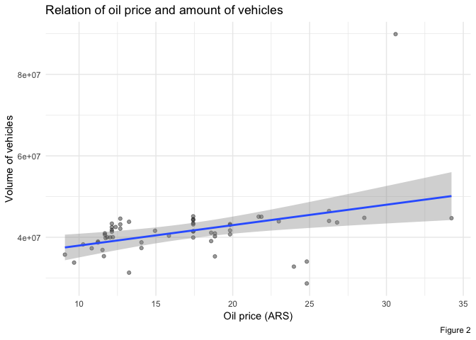
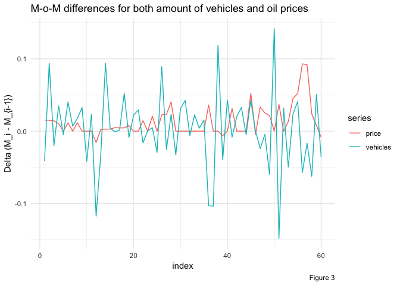

-   [Objective](#objective)
-   [Joining the traffic dataset with the oil dataset](#joining-the-traffic-dataset-with-the-oil-dataset)
-   [Analysis of oil price behavior](#analysis-of-oil-price-behavior)

### Objective

This project consists on estimating time-spent by drivers on AUSA toll booths in Buenos Aires highways. Currently users of these highways experience excessive amount of time waiting to go through toll booths on peak hours. In addition to estimating this metric, an analysis of whether contextual variables like toll-booth fee or oil prices have an impact on the behavior and amount of users commuting through these highways.

### Joining the traffic dataset with the oil dataset

The `traffic.csv` dataset previously analized [here](https://github.com/tulians/traffic/tree/master/descriptive) has a file size of approximately 562MB, while the `oil_prices.csv` dataset is only 11.2KB. We'll be merging both files in an inner join fashion, using the year and month columns via the [`merge()`](https://www.rdocumentation.org/packages/base/versions/3.6.0/topics/merge) function. As a result of this merge each existing row in `traffic.csv` will be repeated 4 times, one per each oil type, thus taking the final, merged, dataset to an approximate size of 2.2GB.

R requires that variables are stored in RAM in its entirety, so managing a dataframe this big could be imposible for some machines if no alternate processing is performed. For this reason is that the [`ff`](https://cran.r-project.org/web/packages/ff/index.html) package will be used.

### Analysis of oil price behavior

The oil prices dataset consists of monthly prices of different types of oil: super, premium, gasoil, and euro. The four of them experienced a steady increase since 2008 until 2018, which is illustrated in Figure 1.

Building on top of the previous analysis of traffic patterns performed [here](https://github.com/tulians/traffic/blob/master/descriptive/README.md), it would be intersting to analyze whether there was a correlation between the rate at which the number of vehicles passing through toll booths [started to grow month-over-month](https://github.com/tulians/traffic/blob/master/descriptive/README_files/figure-markdown_github/trend-1.png), and the month-over-month (M-o-M) increase in oil prices depicted in Figure 1. As seen in Figure 2 (condidering only information from January 2014 onwards, after the [unexpected growth](https://github.com/tulians/traffic/tree/master/descriptive#increment-in-traffic)) there is barely a linear relation between these two differences, which is represented by the Pearson correlation coefficient of 0.3871544. This correlation, even though it's not strong, it's positive, which implies that an increase in oil prices does not necessarily result in a decrease in traffic volume, but rather the opposite in this case.

A more interesting approach in the search for a relation between vehicle volume and oil price would be to look at the M-o-M differences of each time series. Figure 3 shows the behavior through time of the difference of each of the variables, which was computed over the normalized series. Again, computing the correlation between both differences yields a positive number, 0.0757591, which shows non-conclusive evidence that an increase in oil price could impact the volume of vehicles passing through toll booths (at least not in a month by month basis).

