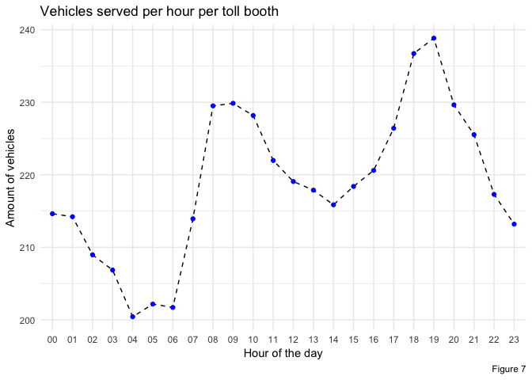
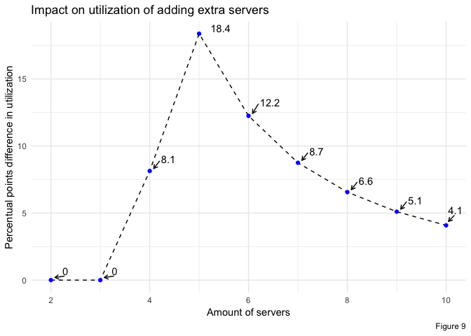
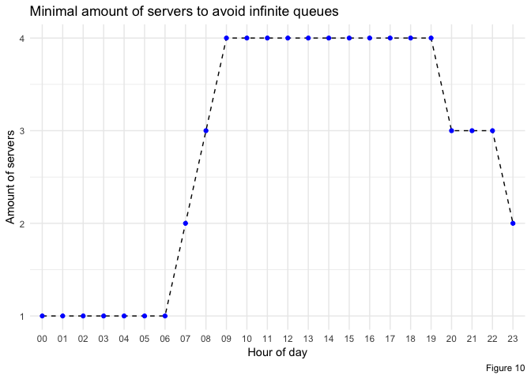
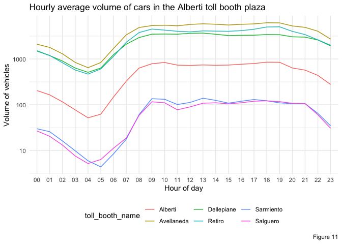
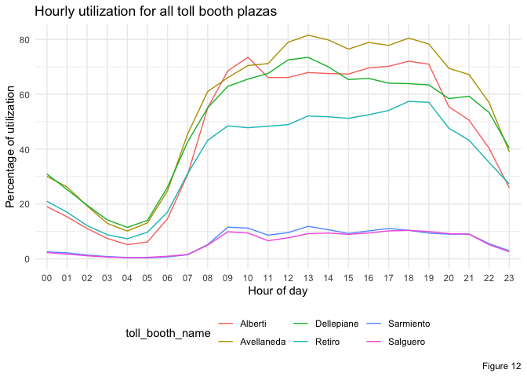
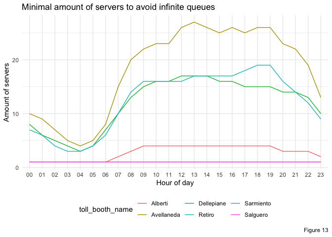
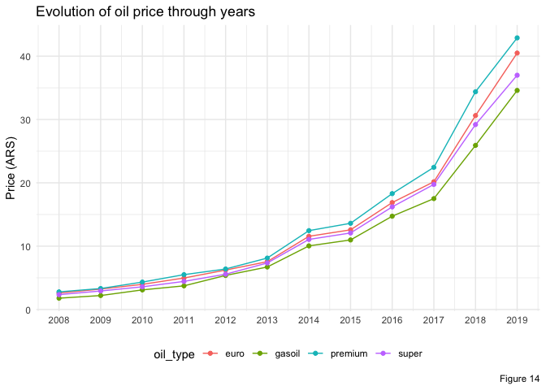
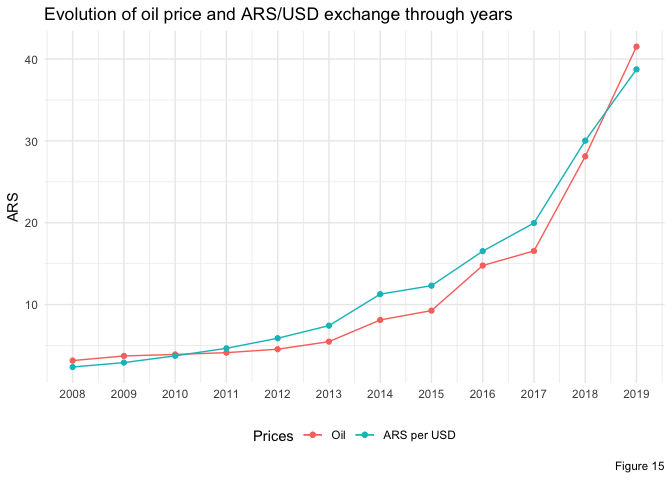
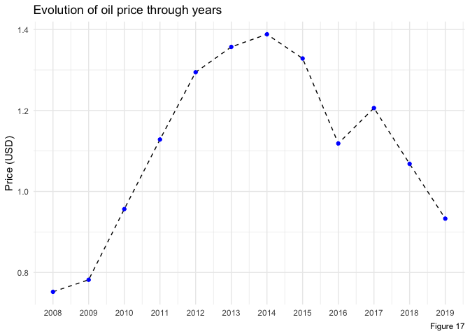

Estimation of time-spent on AUSA toll booths
================
Julián Ailán

-   [Objective](#objective)
-   [Joining the traffic dataset with the oil dataset](#joining-the-traffic-dataset-with-the-oil-dataset)
-   [Time spent waiting on queues estimation](#time-spent-waiting-on-queues-estimation)
-   [Characterization of each AUSA's toll booth plazas](#characterization-of-each-ausas-toll-booth-plazas)
-   [Oil prices analysis](#oil-prices-analysis)

### Objective

This project consists on estimating time-spent by drivers on AUSA toll booths in Buenos Aires highways. Currently users of these highways experience excessive amount of time waiting to go through toll booths on peak hours. In addition to estimating this metric, an analysis of whether contextual variables like toll-booth fee or oil prices have an impact on the behavior and amount of users commuting through these highways.

### Joining the traffic dataset with the oil dataset

The `traffic.csv` dataset previously analized [here](https://github.com/tulians/traffic/tree/master/descriptive) has a file size of approximately 562MB, while the `oil_prices.csv` dataset is only 11.2KB. We'll be merging both files in an inner join fashion, using the year and month columns via the [`merge()`](https://www.rdocumentation.org/packages/base/versions/3.6.0/topics/merge) function. As a result of this merge each existing row in `traffic.csv` will be repeated 4 times, one per each oil type, thus taking the final, merged, dataset to an approximate size of 2.2GB.

R requires that variables are stored in RAM in its entirety, so managing a dataframe this big could be imposible for some machines if no alternate processing is performed. For this reason is that the [`ff`](https://cran.r-project.org/web/packages/ff/index.html) package will be used.

### Time spent waiting on queues estimation

It's usual to see vehicles queuing in Buenos Aires' toll booth plazas at peak hours. More than 1.5M vehicles enter the city each day, most of which are people commuting to work. In this context toll booths regularly feature queues that extend through kilometers in highways. The objective of this section is to accurately estimate the average time a given driver waits in order go through the toll booth.

In order to achieve this goal we need to have concrete figures of both the rate at which cars arrive to the toll booths , and also the rate at which cars can be serviced , meaning, the amount of cars that go through the toll booth at a given period of time. Both of the rates would be averages, as they will be considering times where there is a long queue, as well as times where there's no queue at all. The  ratio, known as traffic intensity, will help us identify the average behavior of the queue, given that if  there is a finite probability that the queue can be handled by the booth; on the other hand if  the queue length will become longer and longer without limit up to infinity (at least in theoretical terms).

Given that we have information of traffic flow along several toll booths, we'll use it to derive these two coefficients, and find the value of  for each of the toll booth plazas. Depending on the dimension of this ratio, we'll need to compute waiting time one way or another. More details on this calculations will be given in future sections.

#### Important considerations

##### Toll booth plaza naming, geolocation, and amount of toll booths per plaza

Up to now we've been working with the dataset without validating whether all the information provided was accurate. However, there were mentions in the [previous section](https://github.com/tulians/traffic/tree/master/descriptive#increment-in-traffic) to strange patterns in data. In this section we'll validate that every toll booth plaza name provided in the dataset actually exists, and also where it's located geographically. To perform this validation we'll use a [map](https://www.ausa.com.ar/documentos/AUSA-Mapa-Autopistas.pdf) provided by the same company the information is about.

-   `Alberdi`: *Juan Bautista Alberdi* is an avenue located at [(-34.6429211, -58.4910398)](https://www.google.com/maps/@-34.6429211,-58.4910398,18z) which provides a way to enter the *Perito Moreno* highway. However, there is no toll booth in such entrance. Looking at the previously mentioned [map](https://www.ausa.com.ar/documentos/AUSA-Mapa-Autopistas.pdf), we can validate there is no toll booth sign in the entrance. However, there is such a sign in an actual toll booth in the *25 de Mayo* highway, located at [(-34.6252954,-58.4022763)](https://www.google.com/maps/@-34.6252954,-58.4022763,17z), under the name of *Peaje Alberti* (mind that they differ in one character, as the latter has a *t* instead of a *d*). Given this context, most likely the information we see for *Alberdi* corresponds to *Alberti*, as the latter is the one that has a toll booth, while the former does not. Something important to mention about this toll booth is that it counts with [3 lanes](https://www.google.com/maps/@-34.6253084,-58.399961,3a,75y,296.16h,87.96t/data=!3m7!1e1!3m5!1szK1wuTFcAlvJddIHqUlZWw!2e0!6s%2F%2Fgeo0.ggpht.com%2Fcbk%3Fpanoid%3DzK1wuTFcAlvJddIHqUlZWw%26output%3Dthumbnail%26cb_client%3Dmaps_sv.tactile.gps%26thumb%3D2%26w%3D203%26h%3D100%26yaw%3D317.5315%26pitch%3D0%26thumbfov%3D100!7i13312!8i6656) to enter the city, and [2 lanes](https://www.google.com/maps/@-34.6257901,-58.4001986,3a,75y,84.02h,99.26t/data=!3m6!1e1!3m4!1sTeolsLKGK9ckp3WVWxFLQg!2e0!7i13312!8i6656) to leave. For the sake of the code, I'll keep on using the `Alberdi` label, but everything will be computed with *Peaje Alberti* in mind.

-   `Avellaneda`: the *Parque Avellaneda* toll booth is located at [(-34.6483842,-58.4782827)](https://www.google.com/maps/place/Toll+Parque+Avellaneda/@-34.6483842,-58.4782827,15z/data=!4m5!3m4!1s0x95bcc976fa19271d:0x114032996c02ca46!8m2!3d-34.6478475!4d-58.477942) in the *Perito Moreno* highway. This geolocation matches the location provided in the [map](https://www.ausa.com.ar/documentos/AUSA-Mapa-Autopistas.pdf). This toll booth is much bigger than the one of *Peaje Alberti*, as it's right in the highway, and consists of [16 lanes](https://www.google.com/maps/@-34.6485245,-58.4775302,3a,82.3y,306.63h,84.59t/data=!3m6!1e1!3m4!1s0t2jEnNc2pbxYu3mgSMYiw!2e0!7i13312!8i6656) to enter the city and [17 lanes](https://www.google.com/maps/@-34.6473728,-58.4783124,3a,70.3y,140.7h,90.17t/data=!3m6!1e1!3m4!1s8HtLVelrUWM_-Lq3uKhZJw!2e0!7i13312!8i6656) to leave.

-   `Dellepiane`: the *Dellepiane* toll booth is located at [(-34.6476526,-58.4642902)](https://www.google.com/maps/@-34.6476526,-58.4642902,3a,75y,183.74h,83.19t/data=!3m7!1e1!3m5!1sAJy89f4OeGWzUY4j5jP_kA!2e0!6s%2F%2Fgeo2.ggpht.com%2Fcbk%3Fpanoid%3DAJy89f4OeGWzUY4j5jP_kA%26output%3Dthumbnail%26cb_client%3Dmaps_sv.tactile.gps%26thumb%3D2%26w%3D203%26h%3D100%26yaw%3D278.81256%26pitch%3D0%26thumbfov%3D100!7i13312!8i6656) in the *25 de Mayo* highway. Just like with `Avellaneda`, it's geolocation matches the locationprovided in the [map](https://www.ausa.com.ar/documentos/AUSA-Mapa-Autopistas.pdf). This toll booth is that it only consists of [8 lanes](https://www.google.com/maps/@-34.6476526,-58.4642902,3a,75y,183.74h,83.19t/data=!3m7!1e1!3m5!1sAJy89f4OeGWzUY4j5jP_kA!2e0!6s%2F%2Fgeo2.ggpht.com%2Fcbk%3Fpanoid%3DAJy89f4OeGWzUY4j5jP_kA%26output%3Dthumbnail%26cb_client%3Dmaps_sv.tactile.gps%26thumb%3D2%26w%3D203%26h%3D100%26yaw%3D278.81256%26pitch%3D0%26thumbfov%3D100!7i13312!8i6656) to leave the city, and [15 lanes](https://www.google.com/maps/@-34.6496524,-58.4653365,3a,75y,227.71h,85.06t/data=!3m6!1e1!3m4!1sHLTRXcFyEzF3xV6j9GIvRg!2e0!7i13312!8i6656) to enter.

-   `Illia` and `Retiro`: as per the [map](https://www.ausa.com.ar/documentos/AUSA-Mapa-Autopistas.pdf), the *Retiro* toll booth is located in the *President Arturo Umberto Illia* highway. Contrary to what was mentioned about this two toll booths in the the [previous analysis](https://github.com/tulians/traffic/tree/master/descriptive#increment-in-traffic), given that there is no distinction between those two labels in the official map, they will be considered to be the same toll booth in this analysis. This toll booth has [16 lanes](https://www.google.com/maps/@-34.5752154,-58.3939207,3a,75y,97.32h,90.8t/data=!3m6!1e1!3m4!1sgu6cZza2fn1MaGwSQDCN8Q!2e0!7i13312!8i6656) to enter the city, and [13 lanes](https://www.google.com/maps/@-34.5753211,-58.3920502,3a,60y,297.07h,84.14t/data=!3m6!1e1!3m4!1syPX2FmTEXJDiDXbKJ_60lw!2e0!7i13312!8i6656) to leave.

-   `Sarmiento` and `Salguero`: these two toll booths are the most recent of all, and are completely automatic, thus don't have any kind of barriers of physical toll booths. They rely on a framework that identifies via laser and RFID whether a given car is suscribed to the automatic toll booth pay a fine. Given the fact that this system was recently implemented, and that Google Maps' most up to date photograph is from [2014](https://www.google.com/maps/@-34.5720142,-58.4003746,3a,75y,86.66h,84.34t/data=!3m6!1e1!3m4!1s4EUI6eAipzhLxajyKJyH3Q!2e0!7i13312!8i6656) there is no information on the amount of lanes the system uses, but judging for the [way it is explained in a local newspaper](https://www.clarin.com/brandstudio/autopistas-barreras-funcionan-beneficios_0_BFyjtPTT7.html) the lasers most likely take the width of the lane drivers have to use to enter or leave the highway, this is, 2 lanes in total.

##### Assumptions

-   As you can see from the above links the amount of toll booths per lane was manually counted using Google Maps. However, these amounts are not fixed, and depend on date and time, in order to accomodate the service to the incoming volume of vehicles. The are no official communications from AUSA on how those changes are performed, so for the sake of this analysis the amount of toll booths to use would be the sum of those going in and those going out of the city. This is due to the fact that the information provided is aggregated to a level that does not provide visibility on the direction of the vehicles.

-   Building on this last point, it will be assumed the vast majority of the traffic during the morning peak hour is heading towards the city, while the traffic during the afternoon peak hour is leaving the city.

-   All toll booths in each of the plazas is considered to be the same in terms of technology and service time. The only difference that will be considered would be that of automatic and manual toll booths.

-   Service time is considered independent of the length of the queue.

-   As the maximum dataset granularity is an interval of one hour, all transit for that hour will be considered from that hour only, meaning, it is assumed that no queues carry on from a previous time interval to the following one.

#### Estimation of traffic intensity per toll booth

In the previous section we discussed the need of computing the arrival rate  and service rate  in order to know the traffic intensity . The former can be derived directly from the information provided by the dataset, given that each of its records indicates the amount of vehicles that arrived and went through the toll booths per hour. In order to estimate  a sample toll booth service time was taken from the *Alberti* toll booth plaza. Additionally, only *cars* volume will be taken into account, as sample consists only on cars measurements.

The next three section will consist on a detailed explanation of each of the three variables of , with the objective of estimating the utilization  of the *Alberti* at each hour of the day.

##### Arrivals

At the moment of writing the most recent information the dataset holds is from January 2019. The rationale for using the most recent information to define the arrival rate is that the volume of vehicles going through toll booths steadily increased through the years, so using information from prior years can lower the average arrival volumes. Figure 4 shows the average amount of vehicles that arrive to the *Alberti* toll booth per hour.

The previous figure presents two peaks which correspond to the timeframes of 9am to 11am and 6pm to 8pm. It would be expected that the utilization of the system, length of the queues, and the time spent on them increases when approaching a peak hour. Figure 5 ilustrates the breakdown of the previously shown volume per payment method, which clearly indicates the peaks are mostly driven by users leaning towards the use of the automatic payment method.

##### Service time

The *Alberti* toll booth plaza has a total of 5 toll booths, 2 of them for accessing the *25 de Mayo* highway, and other 3 for leaving it. A sample of 70 observations of vehicles being serviced on this toll booth was taken on a Saturday, which yielded the distribution presenteed in Figure 6.

The density function for the automatic payment method is more narrow than its manual counter part given that the latter could be impacted by many factors like the driver not having exact change prepared to pay, or the toll booth employee taking more or less time to service different clients. The average service time for the automatic payment method is 6.1389744 seconds, while the average service time for manual payments is 24.0293548 seconds.

One characteristic of *Alberti*'s toll booths is they are both automatic and manual, so depending on the payment method of choosing of the driver, they can pay with cash or with an electronic tag. In summary, Figure 5 tells us there are moments of the day where automatic payments have more impact, while Figure 6 illustrates the densities of each payment method, and how service time differs between them. Such difference has to be taken into account when computing the service rate  for the estimation of the traffic intensity .

For this reason the service rate has to be expressed as a weighted sum which is function of the mean service times and its relative hourly weight. Such relation can be expressed as  where  indicates the percentage of vehicles paying with the automatic payment method at the hour , and  indicates the percentage of vehicles paying manually at the hour , or . The resulting hourly values of  are presented in Figure 7

##### Traffic intensity

Traffic intensity is defined as the ratio between the arrival rate  and the service rate , so that . That condition ensures the system is stable. However, it only accounts for the case of a single server, while in this case we have  toll booths per plaza. This yields a system stability condition of , thus defining  as . Following the third assumption in the assumptions section, as all toll booths are considered equal, we can express the total capacity of the system by multipying an individual toll booth capacity by the amount of toll booths in a toll booth plaza.

Given the definitions of  and  in the prior two sections, the utilization of the *Alberti* toll booth plaza can be described by Figure 8, which presents the percentage of utilization of the 5 toll booths in such plaza. The moments where the toll booth plaza is mostly used are peak hours, with 10am having a 73.5% utilization, and 6pm with 72% utilization.

##### Characterization of the M/M/S system

The system will be modeled as an M/M/S queuing model, where the first *M* stands for a Poisson distributed arrival pattern of vehicles. From here is that we derive , the mean of such distribution. The second *M* stands for an exponential distribution of the service rate . Lastly, S stands for the number of servers, in this case toll booths per toll booth plaza, with a First In - First Out discipline. Summing everything together, the system will be considered stable if , as previously mentioned.

###### Probability of an idle system.

Traffic intensity  can be used to determine the probability of having no vehicles queuing in the system at a given moment of time, and is written as  = \frac{1}{\sum_{n = 0}^{S - 1}\frac{\rho^n}{n!}+\frac{\rho^S}{S! \left (1-\frac{\rho}{S} \right)}}"), where  is the number of toll booths. This definition of  is used as a building block for the metrics that follow.

###### Average number of units in queues

The average queue length can be derived using the probability of having an empty queue . For the general case of  servers, the average queue length is defined as ![L\_q(S, \\rho) = P\_0\\frac{\\rho^{S+1}}{S!S}\\left \[ \\frac{1}{\\left (1 - \\frac{\\rho}{S} \\right )^2} \\right \]](https://latex.codecogs.com/png.latex?L_q%28S%2C%20%5Crho%29%20%3D%20P_0%5Cfrac%7B%5Crho%5E%7BS%2B1%7D%7D%7BS%21S%7D%5Cleft%20%5B%20%5Cfrac%7B1%7D%7B%5Cleft%20%281%20-%20%5Cfrac%7B%5Crho%7D%7BS%7D%20%5Cright%20%29%5E2%7D%20%5Cright%20%5D "L_q(S, \rho) = P_0\frac{\rho^{S+1}}{S!S}\left [ \frac{1}{\left (1 - \frac{\rho}{S} \right )^2} \right ]").

###### Average waiting time for units in queues

The ") metric can be reused to define the time spent waiting on queues as  = L_q(S, \rho)/\lambda"), and it units are hours, given that  is defined in hours for this particular analysis.

###### Example application for the 10am peak hour

In a previous section it was shown that the highest utilization of the *Alberti* toll booth plaza happens during the interval of time between 11 and 12, with a percentage of utilization  of 73.49%. That number is obtained by computing . For this particular set of metric values, the average length of the queue  would be 1.21 vehicles, the average time spent in a queue  would be 5.18 seconds, the probability of arriving at an empty queue  would be 2.07%, and the probability of having to wait to go throught he toll booth  would be 43.56%, for the mentioned utilization of 73.49%.

###### Variable servers number for a fixed point in time

The previous example has such performance metrics with the assumption that the *Alberti* toll booth plaza is servicing users with 5 toll booths. The table shown below exemplifies the behavior of the toll booth plaza on its entirety for scenarios where the amount of servers is different than 5.

    ##     S          Lq          Wq        P0          PD       rho
    ## 1   1         Inf         Inf 0.0000000 100.0000000 100.00000
    ## 2   2         Inf         Inf 0.0000000 100.0000000 100.00000
    ## 3   3         Inf         Inf 0.0000000 100.0000000 100.00000
    ## 4   4 9.324984572 40.03802240 0.8843958  82.5816329  91.86452
    ## 5   5 1.207561118  5.18481920 2.0681405  43.5566598  73.49162
    ## 6   6 0.334325677  1.43547036 2.3982743  21.1574430  61.24301
    ## 7   7 0.104182970  0.44732300 2.4955116   9.4283420  52.49401
    ## 8   8 0.032699484  0.14039945 2.5243968   3.8491187  45.93226
    ## 9   9 0.009941496  0.04268509 2.5328054   1.4407802  40.82868
    ## 10 10 0.002879719  0.01236444 2.5351631   0.4957145  36.74581

As shown in the table above, any amount of servers lower than 4 toll booths will result in an infinite queue, as both  and  are infinite due to the fact . Looking at the values of , the biggest step in diminishing utilization appears when moving from 4 servers to 5 servers. As shown in Figure 9, there is a drop of 18.4 percentual points in utilization when a fifth toll booth is added to the plaza. This is the same amount of servers the *Alberti* toll booth plaza has today, and is a critical step in the design of a toll booth plaza.

###### Minimum amount of servers needed per hour of day

The previous section illustrated the importance of having a minimum amount of servers available for the system to be stable (meaning ). As that section was specific for the 10am - 11am time period, this section extends it to the remaning intervals of time during the day.

Figure 10 describes the amount of servers needed for the *Alberti* toll booth in order to avoid infinite queues. Around 10am a recommended amount of 4 toll booths is indicated, which is consistent with the results shown in the table above, where the change from 3 to 4 servers droped the length of the queue and waiting time from infinite to a concrete number. Having said that, the amount of servers displayed in Figure 10 is only the minimum amount required to have a stable system, but not one that minimizes queue length or waiting times.

### Characterization of each AUSA's toll booth plazas

Building on the methodologies and calculation of traffic intensity and time spent on queues, this section is going to extend such analysis to the whole of AUSA toll booth plazas.

#### Volume of vehicles going through each toll booth plaza

The amount of vehicles that each toll booth plaza services is the building block for futher design decisions with respect to amount of toll booths, and thus average time-spent on queues. Figure 11 describes the traffic evolution during the day for each toll booth plaza. In terms of behavior, each of the toll booth plazas is subject to the same trend, but with different orders of magnitude.

#### Utilization of each toll booth plaza throughout the day

Interpreting the arrivals information on Figure 11 as the arrival rate , and reusing the service rate information obtained empirically, an estimation of the hourly utilization  of each toll booth plaza is presented in Figure 12. The top 3 more utilized toll booth plazas are: Avellaneda with a maximum average utilization of 81.5%, Alberti with a maximum average utilization of 73.4%, and lastly Dellepiane with a maximum average utilization of, again, 73.4%. 

#### Minimum average number of toll booths required for each plaza

The average utilization presented in Figure 13 uses the amount of servers that can be found in Google Maps. However, those amounts are actually higher than what is theoretically needed to avoid infinite queues. However, these additional toll booths are needed, since the theoretical values are averages, which means there can be situations where the traffic is higher than expected and may require an additional toll booth to cater for it. 

The table below shows the difference between the actual number of toll booths in each toll booth plaza and the minimum amount required to avoid infinite queues. The greatest difference appears for the Retiro toll booth plaza, where the minimum amount of required toll booths is around 59.4% of the existing toll booths, while for other plazas with high vehicle volumes such ratio is 84.4%.

    ##         name actual minimum difference
    ## 1    Alberti      5       4          1
    ## 2 Avellaneda     32      27          5
    ## 3 Dellepiane     23      17          6
    ## 4     Retiro     32      19         13
    ## 5  Sarmiento      2       1          1
    ## 6   Salguero      2       1          1

### Oil prices analysis

The oil prices dataset consists of monthly prices of different types of oil: super, premium, gasoil, and euro. The four of them experienced a steady increase since 2008 until 2019, which is illustrated in Figure 14.

Even though the oil price has been increasing since 2008, inflation in Argentina followed a similar trend, as shown in Figure 15. In order to interpret the actual oil price, the current figures are divided by the yearly mean dollar exchange price (provided by the [Banco Central de la República Argentina](https://www.bcra.gob.ar/PublicacionesEstadisticas/Evolucion_moneda.asp)). 

Taking differences of the ratio between oil price and ARS/USD exchange rate, Figure 16 shows there are two interesting points in time, where the oil price drops, comparing 2015 with 2016, and afterwars increases, comparing 2016 with 2017.

However, these differences are in the order of cents, as the prices vary at most 20c. The stability of oil price expressed in dollars is illustrated in Figure 17.

