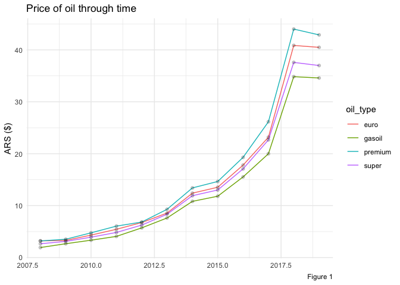

-   [Objective](#objective)
-   [Exploratory analysis of the oil prices dataset](#exploratory-analysis-of-the-oil-prices-dataset)

### Objective

This project consists on estimating time-spent by drivers on AUSA toll booths in Buenos Aires highways. Currently users of these highways experience excessive amount of time waiting to go through toll booths on peak hours. In addition to estimating this metric, an analysis of whether contextual variables like toll-booth fee or oil prices have an impact on the behavior and amount of users commuting through these highways.

### Exploratory analysis of the oil prices dataset

The oil prices dataset consists of monthly prices of different types of oil: super, premium, gasoil, and euro. The four of them experienced a steady increase since 2008 until 2018, which is illustrated in Figure 1 for the particular case of premium oil.

